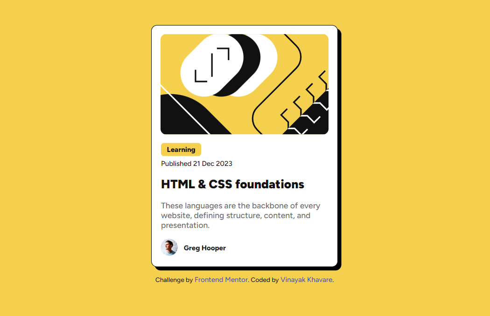

# Frontend Mentor - Blog preview card solution

This is a solution to the [Blog preview card challenge on Frontend Mentor](https://www.frontendmentor.io/challenges/blog-preview-card-ckPaj01IcS). Frontend Mentor challenges help you improve your coding skills by building realistic projects. 

## Table of contents

- [Overview](#overview)
  - [The challenge](#the-challenge)
  - [Screenshot](#screenshot)
  - [Links](#links)
- [My process](#my-process)
  - [Built with](#built-with)
  - [What I learned](#what-i-learned)
  - [Continued development](#continued-development)
- [Author](#author)

## Overview

### The challenge

Users should be able to:

- See hover and focus states for all interactive elements on the page

### Screenshot

- when not hovering 
- while hovering 

### Links

- Solution URL: [Add solution URL here](https://your-solution-url.com)
- Live Site URL: [Add live site URL here](https://your-live-site-url.com)

## My process

### Built with

- Semantic HTML5 markup
- CSS custom properties
- Flexbox

### What I learned

Felt like I had finally started doing something, the transition when hovering makes the card feel alive. A small animation makes it worth more than it already is.
```css
.card:hover {
    cursor: pointer;
    transform: translateY(-5px);
    box-shadow: 6px 6px black;
    transition-duration: 0.5s;
}
```
### Continued development

Styling really is taking more time than writing html, so I'll focus more on styling and then move on to javascript and react.

## Author

- Frontend Mentor - [@Vinayak-Khavare](https://www.frontendmentor.io/profile/Vinayak-Khavare)